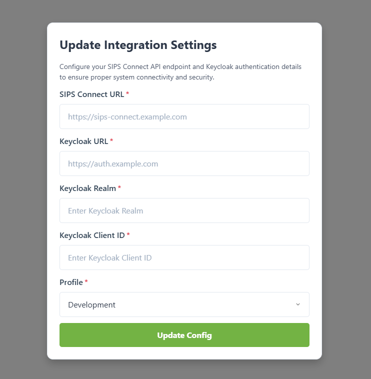

# SIPS.Connect.Portal

[](https://hub.docker.com/r/abdoulhakim/sips-connect-portal)
[](https://hub.docker.com/r/abdoulhakim/sips-connect-portal)
[](https://www.docker.com/)
[](#)

A **Dockerized Next.js portal** for the SIPS Connect platform, running with HTTPS and **UI-driven runtime configuration**.

No `.env` files.
No rebuilds for config changes.
Just start the container and configure everything from the UI.

---

## 🔖 Branching & Releases

- `main` → always points to the latest stable version
- `release/x.y.z` → frozen release branches for previous versions

---

## ✨ Key Features

* 🔐 HTTPS enabled by default
* 🧠 Runtime configuration via JSON (editable in UI)
* 🚫 No `.env` files required
* ♻️ Persistent config across restarts
* 🔑 Keycloak authentication support
* 🐳 Docker Hub–ready image
* 🧼 Clean separation of code, config, and secrets


This makes the portal:

* Easier to deploy
* Safer to share
* Faster to configure
* Friendlier for non-developers

---

## 📁 Project Structure

```
SIPS.Connect.Portal/
├── tls-certs/                # TLS certificates (user-provided)
│   ├── tls.crt               # TLS certificate Provided by user
│   └── tls.key               # TLS private key Provided by user
├── ui-config/                # Runtime configuration (included by default)
│   └── settings.json
├── docker-compose.yml
├── Dockerfile
├── entrypoint-https.sh
├── .gitignore
├── .dockerignore
└── README.md
```

> ✅ The project ships with a default `settings.json`
> ❗ The **only required user setup** is providing TLS certificates

---

## 🔐 TLS Certificates (Required)

### Local Development (Self-Signed)

```bash
mkdir -p tls-certs
cd tls-certs

openssl genrsa -out tls.key 2048
openssl req -new -x509 -key tls.key -out tls.crt -days 365 -subj "/CN=127.0.0.1"
```

Result:

```
tls-certs/
├── tls.crt
└── tls.key
```

---

## ⚙️ Runtime Configuration (settings.json)

The application ships with a default config file:

```json
{
  "config": {
    "api": {
      "baseUrl": ""
    },
    "keycloak": {
      "url": "",
      "realm": "",
      "clientId": ""
    },
    "profile": "dev",
    "uiGuards": {
      "forceFormCompletion": true,
      "setupConfirmed": false
    }
  }
}
```

### What this controls

* API base URL
* Keycloak authentication
* Active profile (`dev | test | prod`)
* UI behavior guards

All values can be **updated directly from the UI** after startup.

---

## 🐳 Running the Application

```bash
docker-compose up -d
```

Then open:

```
https://localhost:3000
```

Accept the browser warning if using self-signed certificates.

---

## 🖼️ First-Time Setup (UI Flow)

When the portal starts for the first time:

1. Default configuration is loaded
2. Setup screen is displayed
3. User enters API & Keycloak details
4. Configuration is saved to disk
5. Portal becomes fully operational

### Screenshots

---

## 📌 Summary

**User responsibilities:**

* Provide TLS certificates

**Everything else:**

* Handled by the application UI

This is intentional by design.
